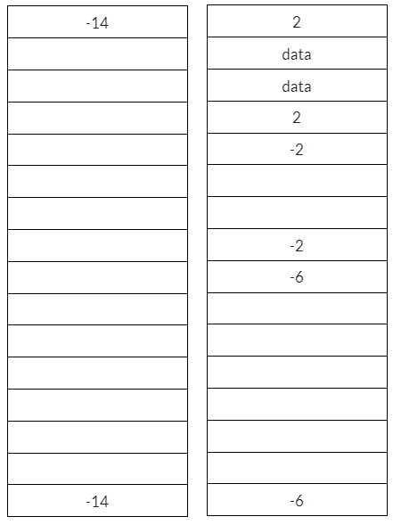
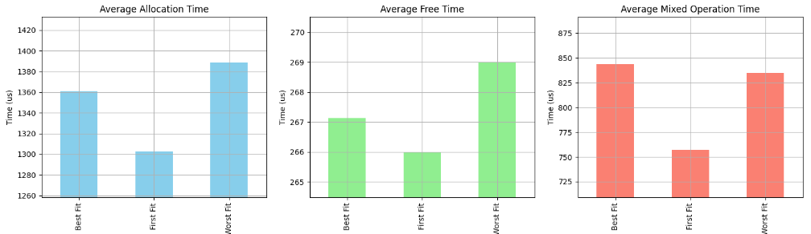
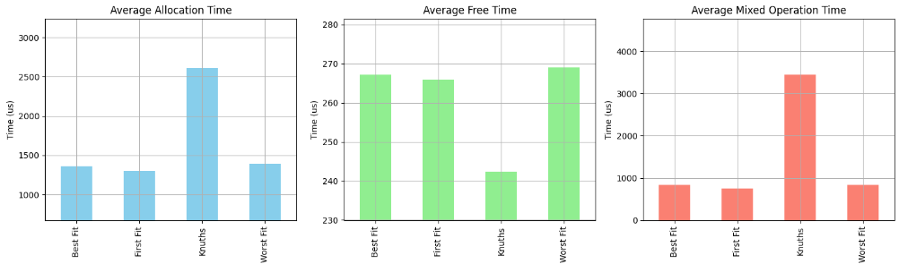
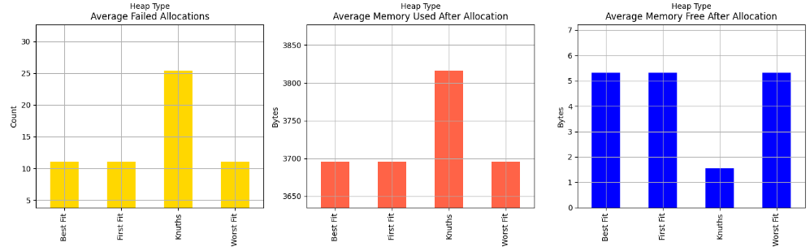

# RTOS Heap Manager Comparison

This project implements four different heap managers: First Fit, Best Fit, Worst Fit, and Knuth's Buddy Algorithm. The project includes a heap tester to validate each implementation, as well as a stress tester module used to log data about the performance of each heap manager. The output from these tests can be saved to a CSV for analysis.

## Project Details

- **Author:** Alex Prucka (aprucka@utexas.edu)
- **Date:** April 20, 2024
- **Course:** RTOS Final Project (EE445M/EE380L.6)
- **Instructors:** Andreas Gerstlauer (gerstl@ece.utexas.edu)

This project is an extension of Lab 5 from the RTOS course, and it has been structured to allow for easy testing and comparison of different memory management implementations.

### Components

- `HeapTesterMain/HeapTester.c`: The main launchpoint for testing
- `RTOS_Labs_common/heap.c`: Acts as a switchpoint to each different heap implementation.
- `RTOS_Labs_common/heapfirstfit.c`: First Fit heap management.
- `RTOS_Labs_common/heapbestfit.c`: Best Fit heap management.
- `RTOS_Labs_common/heapworstfit.c`: Worst Fit heap management.
- `RTOS_Labs_common/heapknuth.c`: Knuth's Buddy algorithm heap management.
- `other OS code`: OS.c and other functions are included to support the heap testing. These were developed in labs, or provided by valvanoware. 

### Functionality

- **Heap Tester:** Tests the basic functionality of each heap impelmentaiton.
- **Stress Tester:** Stress tests each heap implementation by logging the output via UART. This output can be saved to a CSV and analyzed. The tests include:
  1. Allocating NUMBLOCKS blocks of random sizes and logging the time taken, memory successfully allocated, and any allocation failures. Free, used, and wasted space is tracked after allocating.
  2. Freeing all successfully allocated blocks and logging the time taken to free the blocks.
  3. A sequence of allocations and deallocations is performed with random data sizes, and the time it takes is recorded. Free, used, and wasted space is tracked after the mixed operations.

The same random seed is set for each heap type before conducting a predefined number of tests (`NUMTESTS`) to ensure fairness in the random in the allocation patterns. A total of 1000 tests were used for data collecting and analysis.

### User Interaction

- **SW1:** Launches the heap tester.
- **SW2:** Launches the stress tester.

## Implementation Details

The implementation of each heap manager is designed to showcase different strategies for dynamic memory allocation in a real-time operating system environment. Each file (`heapfirstfit.c`, `heapbestfit.c`, `heapworstfit.c`, `heapknuth.c`) encapsulates the logic specific to the respective algorithm.

### First Fit Heap Manager

This heap manager was implemented for Lab 5. It tracks the heap space by marking the top and bottom of a data section with a posotive or negative size. If the size is negative, the space is free, and if the size is posotive, the space is allocated. First Fit means that it iterates through the sections starting at the top of the heap, and places the data immediately in the first section that is large enough for the requested data.

### Best Fit Heap Manager

The best fit implementation is identical to the first fit implementation, except for the Malloc impelmentation. When looking for a chunk of memory, it searches through every open block, and allocates memory to the within the block closest in size to the requested data. 

### Worst Fit Heap Manager

The Worst fit implementation is identical to the first fit implementation, except for the Malloc impelmentation. When looking for a chunk of memory, it searches through every open block, and allocates memory to the within the block furthest in size to the requested data. This is identical to always placing data in the largest block available.

### Knuth's Buddy System

The implementation of Knuths buddy's algorithm uses the same method of tracking heap indexes as the previous three managers. The total size of the heap must be a multiple of 2, and the size of a data section can be any multiple of 2, minus 2 (for the metadata overhead). An example of the storage representation with an empty heap of size 16, followed by a request of 1 to 8 bytes, is shown below.

When allocating memory, the algorithm first determines the block size needed to best fit the request. It then searches the heap to see if an empty block of the correct size is available. If not, the function `cutBlock` is called. 

`cutBlock` takes a desired block size as input. It then finds the smallest available block larger than the desired size, and splits it in half. Upon a successful cut, it returns a 0. Upon a failed cut, it returns a 1.

If cutBlock failes, then malloc returns Null as there isn't space for the request. If cut block succeeds, malloc is called once again (recursively). This allows a heap of any 2^n size to be partitioned successfully with the same malloc function.

When freeing memory, the algorithm calls a function `mergeBlock`, which takes as input the index of the block that needs to be merged. 

`mergeBlock` determines if the given block is the first or second in the buddy pair, and then checks if the buddy is also free. If the buddy is also free, then it combines the blocks, and calls `mergeBlock` once again recursively with the newly combined and freed block. Like in malloc, this allows the function to handle a heap of any size.

## Analysis of Results

The differences in performance between first fit, best fit, and worst fit are small but logical. First fit is faster at allocating, freeing, and mixed operation time. Allocation makes a lot of sense, as it does not need to parse the entire structure. Best fit and Worst fit are a few percentage points slower than first fit in allocation, freeing, and mixed operations. 

The desire for using one of these implementations vs another would likely come down to use case then. If blocks are likely to be large, then using a best fit strategy would likely lead to more successful allocations. If sizes are completely random, then using first fit for the marginal speed benefit is likely the right choice.

The difference when adding knuths buddy algorithm to the mix however is quite staggering. Knuths takes significantly longer to allocate blocks, where far more memory addresses need to be updated as the heap is parsed into chunks. An alternative form of metadata storing that could track the size and state of blocks with more efficeincy would be required to make the algorithm time competetive. 

When attempting to allocate the same number of blocks of the same sizes, knuths on average failes to allocate space for ~120% more blocks than the other algorithms. It also has significantly more used bytes and less free bytes after allocating data, because the allocated blocks are not the exact size they need to be, but instead rounded to the nearest 2^n. 

In particular cases where data sizes are fixed and the consistency and fragmentation reduciton of knuths buddys algorithm can be taken advantage of, it may be the correct choice. However in an embedded context like this where allocations are small, relatively small in number, and relatively consistent in size and frequency, knuth's buddys algorithm has far more negatives than posotives. 